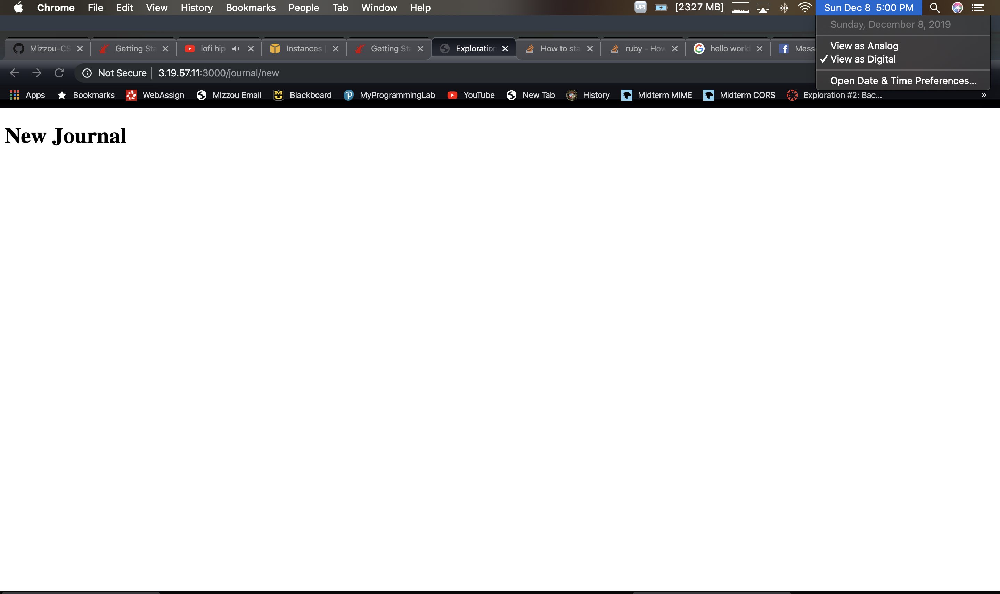

# Matt Hudson - Exploration 4 Journal

**Industry Preparation - Ruby On Rails**

## Code

The Rails application I developed can be found [here](../code/exploration4). The project is running on my web server on HTTPS: https://www.hudso.dev:3000

You can go through this journal for the endpoints I developed, or navigate on the server to use the application.

## What frameworks did you choose and why?

For this exploration, I researched a lot of job postings to see how the skillsets I've learned in this course have come into play, and what's in demand in the industry right now. I found a lot of job listings that use technologies we've learned in class, from Angular/Ionic, to Node servers with Express, to various Python libraries, etc. etc. I also found a lot of job postings that involved similar (but *not* identical) technologies, such as React (similar to Angular in its purpose, but differing in its implementation) and Vue (another SPA framework, this time in JS). I had come across those technologies in the past, and they certainly would be useful technologies, but for
this exploration I wanted to focus on a technology other than these two; partly because many other students are doing React and/or Vue, and also because of my current situation. I interned at Cerner last summer, and worked on some Java/C++/basic HTML/CSS/JS projects there. As I was leaving my internship, my team was starting a project using
Ruby On Rails - and since I'm returning there, and hopefully to the same team, I wanted to learn a technology that was directly linked to my team at Cerner and that would directly impact my internship and work on my team next summer! So, I decided to do Ruby On Rails for this exploration, while learning the Ruby language along the way.

In addition to learning the framework, I also wanted to go over testing capabilities in RoR. There are specific testing components in Rails, but last summer I learned a lot about unit/integration/system testing, and how to implement this in Java using jUnit and Hamcrest. So, I wanted to a) define these core concepts in general (not directly related to RoR), and b) do some testing in RoR's implementation to see how it works in a different environment than Java.

(so in this case, the 'Job Posting' I'm doing the exploration on is actually my future internship next summer/ a future position at Cerner. I cleared this idea with Prof. Wergeles before starting).

Also, I found a job posting from Cerner that required Rails: https://www.linkedin.com/jobs/view/1636865706/ . Its requirements are very close to what I worked on in my internship. So nonetheless, it's a skill that is useful in the industry, and definitely at Cerner.

## What did you learn about/accomplish in these frameworks?

For this exploration's implementation, I followed the Rails Getting Started guide, while adapting the tutorial to make a similar application. In addition, I added bootstrap styling, along with additional features such as having regular expression validation and a different model. This is going above and beyond that simple tutorial so I have a complete working demo application ala previous explorations.

### [0] What is Ruby On Rails?

Ruby On Rails (colliqually known as *Rails*) is an open-source web application framework for the Ruby language. It follows the **MVC** architecture which we've covered and used extensively in class, with frameworks such as Angular/Ionic, Node/Express, MongoDB, etc. used together to create the MVC architecture. The difference for Rails is that the entire MVC architecture is in Ruby. One issue with the MEAN stack is that there are multiple technologies stitched together to make MVC work - in Rails, everything is one place.

Rails is open-source software: you can find the GitHub repo [here](https://github.com/rails/rails). In fact, *GitHub itself* is written in Rails! This goes to show how powerful and relevant the technology is in web development. Other applications written in Rails include Soundcloud and Hulu.

Rails is written in the Ruby programming language. I have not programmed in Ruby before, so I realized part of this exploration would involve learning the basics of Ruby in order to understand and use the framework.

### [1] Ruby from Scratch

Ruby itself is a programming language that at first glance looked a lot like Python. Like Python, it is built around a style and programmer-centric philosophy. It's easy to access - one can try the language in a web browser, or download it and run through a CLI/REPL session. It turned out I already had Ruby downloaded on my Mac, so getting started was easy.

The way that "why's [poigant] guide to Ruby" describes Ruby is that it's built from sentences, and tailored to a *human's* understanding. I liked this quote from
the book that sums this up well:

> My conscience won’t let me call Ruby a computer language. That would imply that the language works primarily on the computer’s terms. That the language is designed to accommodate the computer, first and foremost. That therefore, we, the coders, are foreigners, seeking citizenship in the computer’s locale. It’s the computer’s language and we are translators for the world.

This struck a chord with my knowledge of Python and its 'Zen'. In fact, Ruby operates on many of the same ideas as Python, but just written differently. For instance, you 
use the `ruby` command to run an interactive session with Ruby. You can do the same by loading in code and having it run. Ruby has its own package manager called `gem`
which acts the same as `pip` for Ruby. 

So here's some of the big takeaways I got from my startup with Ruby: 

1. Ruby has a lot of a variable's function included in its syntax. For instance, lowercase variables are just variables, but *any variable* that starts with a capital letter
is inherently a constant. Additionally, Ruby has *symbols*, which start with a `:` and are similar to strings.

2. Ruby is object-oriented as well. A `::` is used to access instance methods. This is also used with constructors, such as `Coat::new()` to make a new Coat object. You also have instance variables, which are designed by an `@`. Class variables (akin to `static` variables) are designated by `@@`. Global variables are designated by a `$`.

3. Ruby uses Blocks to contain code - essentially like a function. Ruby also uses block arguments contained in `| pipes |`. These are just like parameters to a function.

4. Ruby uses arrays and dictionaries just like most languages do nowadays.

5. Ruby's type system is similar to Python's in that it is dynmically typed. Unlike languages such as C or Java, you don't specify a variable's type when you initialize it - 
instead, Ruby has type inference for common types.

#### Test-Driven Development

One huge aspect that Ruby focuses on is **Test-Driven Development**. This is something I was introduced to last summer, and something I wish I'd learned of sooner! Ruby provides native support for automated testing, which is huge. Testing is something that I've found to be incredibly important in enterprise-level development, and it's important to learning Ruby and writing great code. 

The basic idea of Test-Driven Development (TDD) is that *the tests come first, i.e. they DRIVE the development of the implementation.*. So essentially, here's the process whenever you're developing something:

1. Write the test. It should **fail**. Why? The implementation isn't there yet.

2. Go to the implementation and write code to pass the test. This way, you know you're writing for the test; if you invert these steps (i.e. write the test after
implementation) there's no guarantee that the test is actually testing the right thing.

3. Repeat.

This is something I saw in Ruby, but not in Rails. But for instance, if you're making a new route, you could first write tests that check if the route returned a 200 HTTP status code, then you could write a test to check the actual response. But the important thing is that you write the test before, so the test won't depend on the implementation. For instance, if you did it the other way, one could be tempted to write the test as 'I'll check that the `<h3 class='title2'` header contains the value 'Candies'.' But, that entirely depends on the implementation, and the specific header/class you're using. So instead, using TDD, you'd write the test to check if the page contains an element matching 'Candies' at some point in the page. This decouples the testing logic from implementation, and leads to maintainable code and better testing logic.


### [2] Getting started with Rails

The big two aspects of web development Rails emphasizes is that:

1. Don't Repeat Yourself. This is a huge thing to consider when talking about boilerplate code and such. When you're writing code, you should only have to write down
a particular bit of code once. If you're doing the same thing over and over, it's not a good sign that you know how to code properly. Rails is great about limiting
what you have to repeat. In a sense, less is more.

2. Convention over Configuration. Definitely something I had come across in running my Angular/Ionic projects was having to edit configuration files. It's never the
most enticing of tasks to do, and Rails seeks to do as much as it can for you, so the developer can focus on actually writing the server's code.

Rails also uses sqlite, which we'd covered before in class, so adjusting to this was a breeze.

As ruby has a package manager akin to `pip` called `gem`, you use this to install rails:

`gem install rails`

Once this is installed, you can use the `rails` cli (the same idea as ng, ionic, etc. etc.) to generate new projects and components. Once again, convention over configuration!

Like a node server, you can have the project directory wherever you want in your filesystem. So running `rails new exploration4` in my home directory created the basic project and I was able to go into that directory. On first glance, the layout looks very much like Angular/Ionic - you have `app` with contains your models, views, controllers, etc., and you have configuration elsewhere. To run the server, you just need to run `rails s -b 0.0.0.0` which will open the server on port 3000 to all other hosts. **Without -b, the server will only listen locally!**. After this, I was able to see the welcome page and start doing some development:


### [3] Controllers and Views

Rails is built upon the MVC architecture, but unlike Angular, Rails is explicit when you define controllers and views. So instead of modules/components/services/etc in Angular, you have literal controllers/views/models that define the Ruby application. Luckily, you can use `rails` to generate a controller, which also makes the view file for you: `rails generate controller Hello index`

The controller is located in the `controllers` directory, and contains the controller, written in Ruby. By default, it doesn't have much in it.

The view is located in `views/hello` as `index.html.erb`. Basically, this is akin to templates in Angular. But here, instead of embedding typescript and angular directives in the html, you're embedding Ruby. But, you can always just serve up plain html, just like an Angular component.

Just like Angular, Rails uses *routing* to define how different URLs should be treated. In the case of Rails, this maps to a *controller* and an *action* in that controller. By default, we created the `index` action in the `Hello` controller. So, we need to add this line of code in the routing file, which is `config/routes.rb`:

```ruby
Rails.application.routes.draw do
  get 'hello/index'

  root 'hello#index'
```

In this case, 'hello' is the *controller*, and 'index' is the *action* in that controller. This will end up loading the content we define in 'index.html.rb' for the document root.

We can also map get requests to this controller/action like so:

```ruby
get 'hello' => 'hello#index'
```

You can read this as going to `<your ip name>/hello` - this URL is mapped to the hello controller with the index action.

### [4] Making a RESTful web component using `resources` and actions

Now that I had the basics of routing, I got started making a RESTful interface for a test application. Rails includes a method `resources` that defines some routes
according to RESTful specifications. These are the routes that result when you put `resources :journal` into the routes file:

```bash
      Prefix Verb   URI Pattern                 Controller#Action
  hello_index GET    /hello/index(.:format)      hello#index
        hello GET    /hello(.:format)            hello#index
journal_index GET    /journal(.:format)          journal#index
              POST   /journal(.:format)          journal#create
  new_journal GET    /journal/new(.:format)      journal#new
 edit_journal GET    /journal/:id/edit(.:format) journal#edit
      journal GET    /journal/:id(.:format)      journal#show
              PATCH  /journal/:id(.:format)      journal#update
              PUT    /journal/:id(.:format)      journal#update
              DELETE /journal/:id(.:format)      journal#destroy
         root GET    /                           hello#info
```

So we can see from this output the various routes created by the `resources` method, their associated HTTP method, the URI pattern, and the controller#action taken when
the URI is accessed. So, the first step was creating the journal controller just like I had done before: `rails generate controller Journal`. This time, however, no view was generated (remember, index.html.erb was generated the last time). This is because I didn't define any default action, so at this point the actions aren't created yet.


Going into the controller file, it's akin to Express, in that you define `actions` as `methods`. For example, in my previous Hello controller, this is what rails generated for me:

```ruby
class HelloController < ApplicationController
  def index
  end
end
```

Essentially, we have the `HelloController` class that inherits from the superclass `ApplicationController`. In it, we define a *method* called `index` that defines what happens whenever the `index` action is called. For this controller, it's just an empty method. In this case, the application will find, in the `hello` view directory, a file called `<action>.html.erb` and serve it. So that's how that component works. For the journal controller, I defined some of these methods in the controller - in addition, I made a view for the `/journal/new` route as `new.html.erb`. This is the HTML that will be presented when you go to `journal/new`.

At this point, I realized why the file is called `<action<.html.erb`. The first extension is called the *format* - essentially, we are formatting our view in html. The second extension is called the *handler* - erb stands for embedded ruby, which is what handles the view. The benefit to this is that you can have views in different formats and templates than this standard - some of what I saw included some javascript, builder for XML, etc.

So now, when you go to `<ip>:3000/journal/new`, the route (GET /journal/new) mapes to the journal controller, and the new action. By default, this grabs new.html.erb. Perfect!



At this point, I also defined an action on the Hello controller: `Hello#info` that grabs a separate info.html.erb file. This will display the endpoints of the system, so one knows where to go to test the application.

So now, I had to define a form for this new Journal page. This is where the embedded Ruby comes in - basically, this is akin to Forms in Angular - you use some Ruby
methods to create the form components, and Rails does the rest:

```ruby
<%= form_for :journal, url: journal_index_path do |f| %>
  <p>
    <%= f.label :name %><br>
    <%= f.text_field :name %>
  </p>
  <p>
    <%= f.label :date %><br>
    <%= f.text_field :date %>
  </p>
 
  <p>
    <%= f.label :content %><br>
    <%= f.text_area :content %>
  </p>
 
  <p>
    <%= form.submit %>
  </p>
<% end %>
```

In this case, `<%= ... %>` is like `<?php  ?>`, in that you're embedding another language into the HTML. So whenever this code is happened on, the `erb` part will run ruby code. So in this case, `form_for` is a helper method that sets up the form. The journal_index_path helper plugs in the pathway to the URL path that will submit the form. Then, we embed Ruby to created labels and the actual fields the user fills out. This accesses methods on the `f` variable put into the block, and we provide symbols to those methods in order to define the information.

Once this is done, we get a form!


### [5] Creating Data Models

Up to this point, I'd seen controllers and views; however, we require a model to complete the MVC architecture. Rails has built-in models that are generated just like controllers: using `rails generate model Journal title:stirng date:string content:text` generates this model. Notice here, we are defining the schema for the model: the object has three attributes, where the syntax is `<identifier>:<type>`.

Once you run this first command, the model is not technically created in the database as of yet: you have to perform what's called a *migration*. At this stage, the change is reversible, and this feature is to prevent accidental corruption of the database. Important to note is that the server won't run until this migration is resolved:


So, running `rake db:migrate` created the table in the database, and with that, the only step left was to insert the entries into the database! This is defined in the controller, in the `create` action. We define a class variable named `@journal` and put in the parameters. Then, we simply need to run the `.save` method to store
the information in the database!

```ruby
def create
  @journal = Journal.new(params.require(:journal).permit(:title, :date, :text))
  @journal.save
  redirect_to @journal
end
```

The `redirect_to` redirects to the `show` action, which I had to define. This action expects a route parameter :id, so we have to use that in our controller.
So essentially, we execute a `find` where the id = the provided id, then we set a class variable to hold that article's information (ultimately, it's a dictionary).

In the controller:

```ruby
def show
  @journal = Journal.find(params[:id])
end
```

In the view (show.html.erb):

```ruby
<p> Entry on <%= @journal.date %></p>
<h1> <%= @journal.title %></h1>

<p> <%= @journal.content %> </p>

<hr>
```

Note here the difference between `<%= %>` and `<% %>`. The first (with an `=`) returns the output of the expression as text. It was then, I realized this is interpolation!! Without the equal side, the ruby code is run, but produces no output in the html. So in the form, the `end` omits the `=` because it's just a keyword, and not meant to output anything. With this, once you save your journal entry, you're taken to the corresponding journal page which shows the journal's information:


Lastly, to get **CR**UD working, I needed a way to display all journal entries in the system. With our routes, this is by default the `journal#index` route, which is just the `<ip>:3000/journal` route. So, I defined the index action with an appropriate view. To get all the journal entries, I just used the `Journal.all` method to get all the journals. To display these entries on the page, I used embedded Ruby to iterate through each Journal entry. This functions essentially like an `*ngFor` in Angular!

In the controller:

```ruby
def index
  @journals = Journal.all
end

```

In the view (index.html.erb):

```ruby
<h1>Journal Entries</h1>

<% @journals.each do |journal| %>
        <hr>
        <p>Entry <%= journal.id %> on <%= journal.date %></p>
        <h3><%= journal.title %></h3>
        <p><%= journal.content %></p>
<% end %>
<hr>
```

Doing this, I was able to get a listing of all the journal entries!


### [6] Adding links

Now that I had the Journal application half done, it was time to add some hyperlinks to allow navigation throughout the application. This is done using
the `link_to` operator. This operator (using embedded Ruby) takes in the text to display, and where to go. These path variables are set from the routes
displayed using `rake routes`. Just add `_path` to the end of a route's prefix and it goes where you want it to. So for starters, I added these links to my
info page:

```html
<h1>Matt Hudson's Exploration 4 Rails server</h1>

<h3>Endpoints</h3>
<ul>
        <li>/ - Hello#info -
                <%= link_to 'This page with route info', root_path %>
        </li>
        <li>/hello - Hello#index -
                <%= link_to 'Hello World Page', hello_path %>
        </li>
        <h4>Journal Application</h4>
        <li>/journal - Journal#index -
                <%= link_to 'List All Journal Entries', journal_index_path %>
        </li>
        <li>/journal/:id - Journal#show - Shows specific journal with given id -<a href='/journal/1'>Example</a>
        <li>/journal/new - Journal#new -
                <%= link_to 'Create New Journal Entry', new_journal_path %>
        </li>


</ul>
```

I also added `back` links to all pages, so the user can navigate to and from all pages to/from the info page, like this:

`<%= link_to 'Back', root_path %>`

For each journal, I wanted to add links to each journal page for each journal entry. So, I put a similar expression inside the `.each` Ruby expression. This is
just like using an `*ngFor`. For this path, I needed to make the route for the specific journal. This is really easy, as I just pass in the `journal` object as a
parameter to the `journal_path` helper function.

```html
<% @journals.each do |journal| %>
        <hr>
        <p>Entry <%= journal.id %> on <%= journal.date %></p>
        <h3><%= journal.title %></h3>
        <p><%= journal.content %></p>
        <%= link_to 'This Entry', journal_path(journal) %>
<% end %>
```

After adding the links, you could navigate throughout the application.


### [7] Validating the Form

With our form, we need to validate input. For a journal, we should make sure we have all the fields filled out: title, date, and content. We also should specify that the title is long enough, and the date is in the format mm/dd/yyyy. For this, we add the validation logic to the Model itself, not the controller. We use the `validates` helper function, which is used to add validation. The `validates` helper can contain various parameters, which tell the server how to validate this object. So I wanted to make sure that all 3 fields are there (using `presence`), that the title was at least 6 characters long (using `length`), and that the date matches the given regular expression (using `format`):

```ruby
class Journal < ActiveRecord::Base
        validates :title, presence: true, length: { minimum: 6 }
        validates :date, presence: true, format: { 
                  with: /\A[0-9]{2}\/[0-9]{2}\/[0-9]{4}\z/ }
        validates :content, presence: true, length: { maximum: 100 }
end
```

If these validations don't match, the `Journal.save` method will return `false` instead of `true`, and the record won't be save. Therefore, we can add an `if` statement
in our controller - if it's successful, redirect like always. If not, rerender the form, but display error messages as well.

```ruby
if @journal.save
  redirect_to @journal
else
  render 'new'
end
```

Lastly, in the `new` view, we need to check if there are validation errors, and if so, print them out to the user.

```html
<% if @journal and @journal.errors.any? %>
  <h2>
    <%= pluralize(@journal.errors.count, "error") %> need to be resolved:
  </h2>
  <div>
    <% @journal.errors.full_messages.each do |message| %>
      <p><%= message %></p>
    <% end %>
  </div>
<% end %>
```


### [8] Adding Update/Delete Functionality + View Partials

The last big update I needed to implement was completing **CRUD** with Update and Delete. Note that with the `resources` helper, these endpoints are already defined - I
just needed to implement them. However, for the update page, there's a lot of the same code - for the forms and error messages. The first tenant of Rails is 'Don't Repeat Yourself', and this is where *view partials* come into play. Basically, these are *partial* views, kind of like components of a view. You can then place these partials inside other views, and reuse that code without writing it twice! So, I took this part of the form:

```html
<%= form_for :journal, url: url do |f| %>
<% if @journal and @journal.errors.any? %>
  <h2>
    <%= pluralize(@journal.errors.count, "error") %> need to be resolved:
  </h2>
  <div>
     <% @journal.errors.full_messages.each do |message| %>
       <p><%= message %></p>
     <% end %>
  </div>
<% end %>
<p>
  <%= f.label :title %><br>
  <%= f.text_field :title %>
</p>
<p>
  <%= f.label :date %><br>
  <%= f.text_field :date %>
</p>
<p>
  <%= f.label :content %><br>
  <%= f.text_area :content %>
</p>
<p>
  <%= f.submit %>
</p>
<% end %>
```

and put this into a file `_form.index.erb`. The leading `_` tells Ruby this is a view partial. Then, I can replace this chunk of html with `<%= render 'form' %>`. I had to change this expression, since the url can vary (if we're updating or creating), so I need to pass in the `url` parameter like so: `<%= render partial: 'form', locals: { url: journal_index_path } %>`.

Then, creating the update page was incredibly easy, as it just reuses the page we already have. The `journal#edit` action is the editing page, and the `journal#update` is the PUT HTTP method that will update the database. Note how the routes automatically use the PATCH/PUT methods to Update, like HTTP was designed for a RESTful interface! So in the controller, I added handlers for the `edit` and `update` actions:

```ruby
def edit
  @journal = Journal.find(params[:id])
end
def update
  @journal = Journal.find(params[:id])
  if @journal.update(params.require(:journal).permit(:title, :date, :content))
    redirect_to @journal
  else
    render 'edit'
  end
end
```

For the `edit` view, I only needed to call the `render 'form'` and supply the url and method - this way, my view is only a whopping *3* lines! After this, I could go in and edit my journal entries - the first one needed content, as before I hadn't put in form validation.


Lastly, I needed to add the DELETE method. This would be easier, as there is no form to do - we just need to have a DELETE button that will run the correct action. So, I added this link in the `each` loop in the index view:

```ruby
def destroy
  @journal = Journal.find(params[:id])
  @journal.destroy
  redirect_to journal_index_path
end   
```

Note, this destroy action uses the DELETE http method. This is more secure, since someone could use URL hacking with a GET request if this wasn't the case. After that, all you need to do is add a link to this action in the journal index:

`<%= link_to 'Delete', journal_path(journal), method: :delete %>`

Thus done, you can now click on 'Delete' and delete an Entry! I deleted Entry 2, and afterwards, it's removed from the database.


### [9] Adding Basic Security and Confirmation

The last functional update was to add some security - after all, one should have to authenticate in order to edit or delete journal entries! Luckily, rails provides basic HTTP authentication - it's not as good as OAuth, but it's local and secure. It's only one line of code I had to add in the Journal controller:

```ruby
http_basic_authenticate_with name: "admin", password: "wergel", except: [:index, :show]
```

So you specify the name and password, and the `except` parameter says that you should have to authenticate for all actions *except* index and show. The good thing
about this method is that it saves your authentication, so you only need to enter your credentials once in a while. Using this, a popup will display whenever you try to access
a restricted resource:


Lastly, I wanted to add confirmation when deleting - this is also a one-liner. You add data to the delete link and specify a confirm message:

```ruby
<%= link_to 'Delete', journal_path(journal), method: :delete, data: { confirm: 'Are you sure you want to delete this entry?' } %>
```

While results in an Alert popping up in the browser:


### [10] Final Touches: using Bootstrap

Now that the application was more or less complete, I wanted to add styling to make the UI look presentable. So, I used bootstrap classes just like before. To use bootstrap, I imported the css using a CDN in the main file. The file `app/views/layout/application.html.erb` is like the template for the root component: it includes the frame of every page in the system.

```html
<!DOCTYPE html>
<html>
<head>
        <title>Exploration4</title>
        <!-- this links to bootstrap's CSS CDN -->
  <%= stylesheet_link_tag "https://stackpath.bootstrapcdn.com/bootstrap/4.4.1/css/bootstrap.min.css" %>
  <%= stylesheet_link_tag    'application', media: 'all', 'data-turbolinks-track' => true %>
  <%= javascript_include_tag 'application', 'data-turbolinks-track' => true %>
  <%= csrf_meta_tags %>
</head>
<body>

<%= yield %>

</body>
</html>
```

Simply importing that CSS made the application better immediately. I was then able to go into bootstrap's class list and add classes to my html elements. With that, the application is complete and presentable!

Here are some screenshots of the application:


The completed info page, detailing how to use the application


The completed hello world page, used to test out controllers, actions, and views.


The completed journal page, listing all journal entries in the system.


The completed view page, to view a specific journal entry.


The completed edit page (note the form content is the same for the new entry page, as it is in the view partial `_form.index.erb`).


The completed edit page that displays validation errors. I used bootstrap's `alert alert-danger` classes with a `<div>` to make this error box.

## What do you still want to learn about these frameworks?

Ultimately, there's a lot left to learn about both Rails and Ruby itself. As previously stated, I had not coded in Ruby before, so learning the language's unique syntax style and philosophies is something I want to look into. However, by developing a Rails application, I feel a lot more confident in how Ruby is used and how to develop in the language. Features such as blocking, symbols, methods, etc. etc. are something I want to look into to better understand how rails works.

Another part I want to learn is how TDD (Test-Driven Development) is implemented in Rails. I messed a bit with Ruby's TDD with `assert`, but I did not go into how this would work with Rails. Since I'm familiar with unit/integration/system testing in Java with jUnit and hamcrest, I feel this would be a seamless transistion, and would be interesting to see, especially in a web development environment. 

Lastly, rails has a lot of other tutorials that go into detail as to how Models, Views, and Controllers are defined and many other features that go beyond the scope of this exploration. There's a lot more to learn, especially if this will serve me in a future position at Cerner or another company. This exploration has granted me a great starting knowledge point to jump into Ruby development in the future!

## What problems did you run into?

On my first try starting the rails server, I was getting errors related to not being able to load some particular files. Through research, I came across [the issue](https://stackoverflow.com/questions/47972479/after-ruby-update-to-2-5-0-require-bundler-setup-raise-exception) - it's just a simple update to `gem` to fix this issue. Additionally, I needed to update my version of `rails` using `sudo apt upgrade rails`.

To have the server up on my instance, I needed to allow port `3000` both on `ufw` and through the Amazon EC2 console. Additionally, I used `nohup` to have the server keep running even after I'm done working through ssh on my instance.

Another problem was that even after doing this, I was still getting a connection refused message. It turns out that `rails`, by default, only listens on the localhost (127.0.0.1). So I had to edit my server command to fix this: `rails server --binding 0.0.0.0`.

I had trouble getting HTTPS to work with Rails - it ultimately boiled down to having to know how Webrick and/or thin ran in Ruby. At first, I consigned to not fixing the issue, but after completing the rest of the project, I was able to figure it out (see my sources below). I also realized I had to go to www.hudso.dev:3000 instead of my actual IP - I was getting a common name error with SSL, and that was why.

One neat part of Rails is that when something goes wrong, the website gives you detailed feedback in the browser. Therefore, finding issues is not as frustrating as
with node servers that just don't return anything - if something goes wrong, Rails will tell you exactly what's wrong. For example, before I made the journal controller,
I got this error which told me exactly what was going on:


While I was starting my forms in the `journal` controller, I was getting 500 errors once I put in ruby into `new.html.erb`. The reason for this seemed to be I was using
the `form_with` helper instead of the `form_for` helper. It also might have been that I was using `form_with` the wrong way, but I ended up using `form_for` and the
500 errors finally went away.

While migrating the databse, I got an error while attempting the migration. It turns out I had accidentally created a model for Journal earlier, so I had to remove that model from the database using `rake db:drop`.

A weird error I got when doing the `journal#index` route was that the entire journal hash was printing at the end of the page. The reason for this was because I was using interpolation `<%= %>` with the `@journals.each` method. Since this is a control structure like an `*ngFor`, removing the equal side prevents any output to the page!

I was getting this error while trying to add validation to the journal form: "Missing template journal/New Entry, application/New Entry with {:locale=>[:en], :formats=>[:html], :variants=>[], :handlers=>[:erb, :builder, :raw, :ruby, :coffee, :jbuilder]}. Searched in: * "/home/mrh4hd/exploration4/app/views" - it turns out I forgot 'single quotes' around `new` in my controller. You have to define a string that defines what to render.

While implementing the update functionality, I was having trouble getting the form to use the PUT method - it was going to POST but giving me a routing error. The solution was to define the `method` paramter to the `form_for` in `_form.html.erb`. This way, I specify POST for `new` and PUT for `edit`. Since HTML forms only do GET/POST, Rails
handles this behind the scenes, by adding a hidden input element called 'method' with value 'put'. Rails then takes this hidden output and lets the server interpret that POST request as a PUT request.

## Sources

[Rails Official Site](https://rubyonrails.org/) - the official site for Ruby On Rails. It provided an overview of the framework and links to other documentation.

[Ruby Language Guide](https://www.ruby-lang.org/en/documentation/) - official documentation for the Ruby programming language.

[Why's \[poignant\] guide to Ruby](http://poignant.guide/) - a great.. comic book? Documentation? *tutorial* reminiscent of [Learn You a Haskell for Great Good](http://learnyouahaskell.com/). Definitely made this Exploration more fun to do and Ruby more fun to learn.

[Ruby Koans](http://rubykoans.com/) - a popular 'Getting Started' guide for learning the basics of Ruby.

[RoR Official Guide](https://guides.rubyonrails.org/) - official guide Docs for Ruby On Rails. 

[RoR Getting Started](https://guides.rubyonrails.org/getting_started.html) - a getting started guide for Rails. **I adapted this tutorial to help develop for this exploration.**. I went above and beyond that simple tutorial by adding more features such as new input forms, bootstrap styling, and making a journal app rather than an article app.

[How to run rails in the background](https://stackoverflow.com/questions/4334403/how-to-start-rails-server-in-background/19410421) - a similar idea to `pm2`, but works for rails applications (pm2 is used with Node servers)

[Rails in 60 minutes](https://www.youtube.com/watch?v=pPy0GQJLZUM) - a good supplementary Youtube video detailing the fundamentals of Rails.

[Active Record Validation](https://guides.rubyonrails.org/active_record_validations.html) - part of the guide that explained how to write validator functions for a model, including how to use it with a regular expression.

[Layout and Rendering in Rails](https://guides.rubyonrails.org/layouts_and_rendering.html) - another part of the guide that explains Rails' file layout and what the `render` method does.

[link_to method documentation](https://apidock.com/rails/ActionView/Helpers/UrlHelper/link_to) - documentation to the `link_to` helper function, which helped me figure out how to specify the method a link should take (used this for the delete link). Also, I used this to learn how to apply classes to these links using the `class` paramter.

[stylesheet_link_tag documentation](https://apidock.com/rails/ActionView/Helpers/AssetTagHelper/stylesheet_link_tag) - used this to learn how to use the `stylesheet_link_tag` helper method, which allowed me to link to bootstrap's CDN.

[Bootstrap Class List](https://www.w3schools.com/bootstrap/bootstrap_ref_all_classes.asp) - helped me figure out some bootstrap classes I could use in the application.

[Webrick w/ SSL](https://stackoverflow.com/questions/3640993/how-do-you-configure-webrick-to-use-ssl-in-rails) - used this to finally get HTTPS working for Rails.